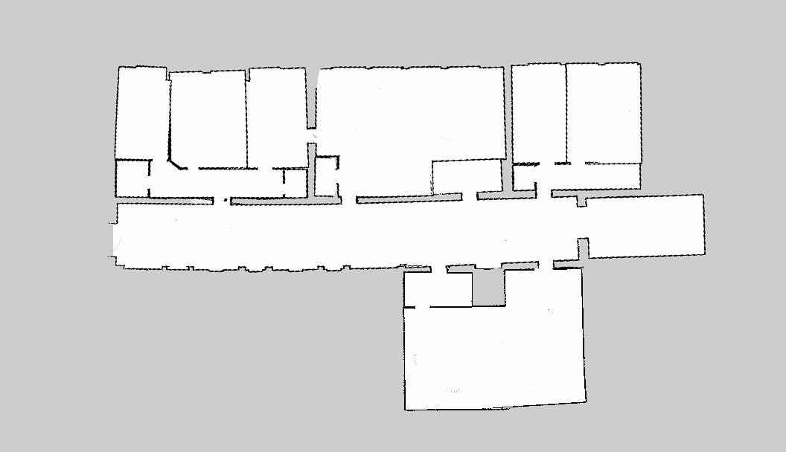
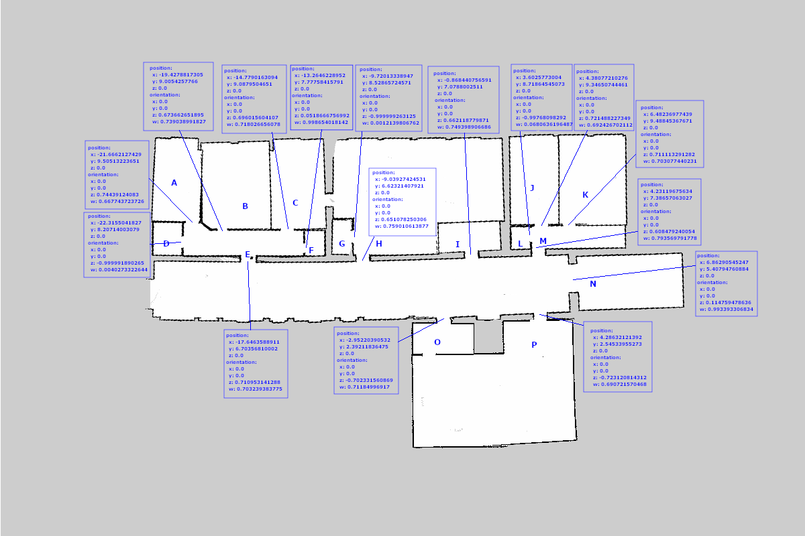

# robot_navigation

## map

position of room also stored in [target_pose.yaml](./param/target_pose.yaml)

## rqt graph

## message
[sensor data message](./msg/sensor_data.msg)

## TO DO

- use [clock](http://wiki.ros.org/Clock) package to simulate the time

- subscribe path and predict path length

- build global occupation possibility table

- write cost function = Θ1 * occupation possibility+  Θ2 * hour different +  Θ3* distance + Θ4* task priority + Θ5 * battery level + Θ6