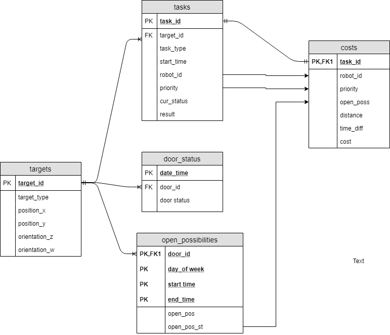
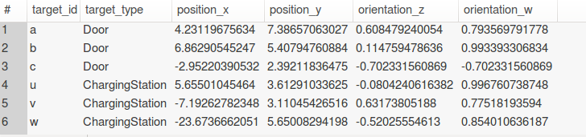
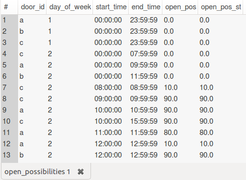
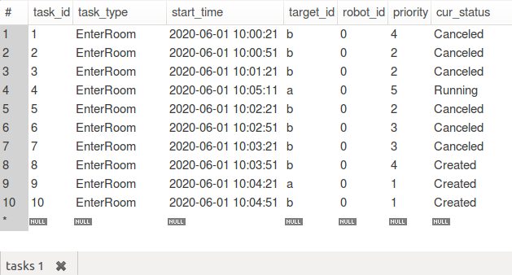
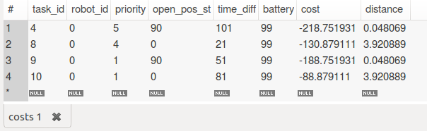
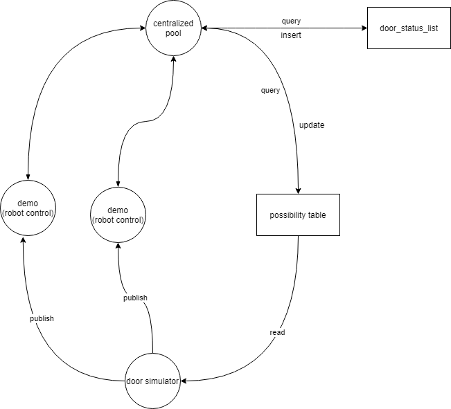
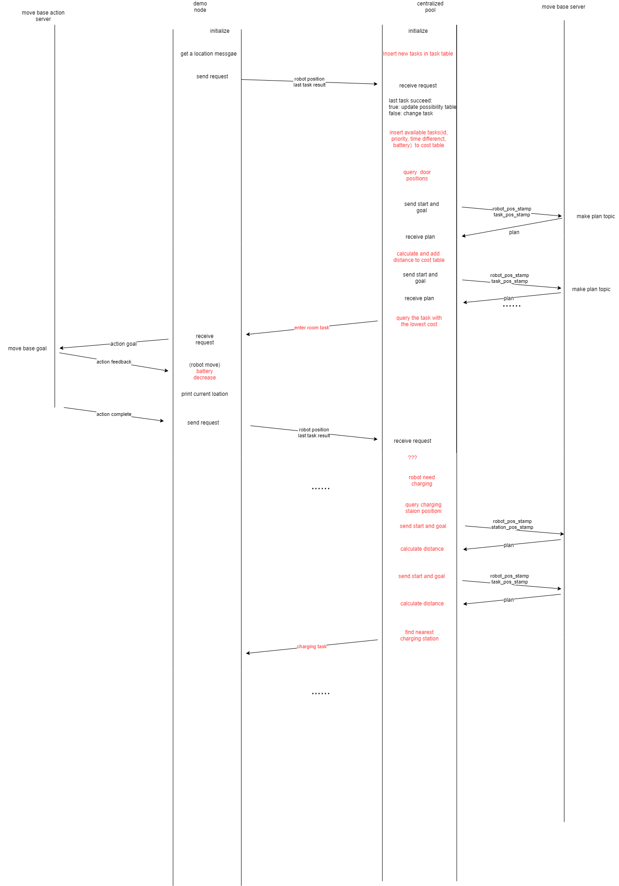

# robot_navigation
## How to use this program

### 1.  Create log file of door sensor:
1. install mysql library
'''
sudo apt-get install libmysqlcppconn-dev
'''

2. log in mysql server 

    `mysql -r root -p`

3. create tables
```
    source /home/[user_name]/catkin_ws/src/robot_navigation/sql/run.sql
```
database 



targets



open_possibilities



tasks



cost



### 2. Set up

run Gazebo world

```
    roslaunch robot_navigation simulation.launch
```
Use keyboard to controll one robot 

```
rosrun teleop_twist_keyboard teleop_twist_keyboard.py /cmd_vel:=/tb3_1/cmd_vel
```

Start sensor node

```
    rosrun rosrun robot_navigation door_status_advertiser
	
```
Start navigation stack

```
    roslaunch turtlebot3_navigation turtlebot3_navigation_multi.launch

```
use estimate position tool in rviz to estimate position

## 3. run demo
```
    roslaunch robot_navigation move_demo.launch
```
## Structure



## work flow


cost_function.cost = 1.0 * distance + 0.2 * sec_diff + (-1.0) * statisic_open_possibility +(-10) * priority  +  (-1.0) * battery_level;

robot choose task with lowest cost


## Relative work

https://ieeexplore.ieee.org/abstract/document/7992870

When the time of the server reaches the request time, the server performs the task allocation. 

https://www.cs.utexas.edu/~pstone/Papers/bib2html-links/AAMAS17-Zhang.pdf

https://ieeexplore.ieee.org/abstract/document/8461113


## battery module

Calculate battery consume use angle of rotation and distance

```
distance = ......
double angle = 2 * acos(feedback->base_position.pose.orientation.w);
battery_level=  battery_level - 0.01 * distance - 0.001 * angle;

```

## Task type(plan)
| Type             | target |possibile parent/child task type    | Priority | Can be interrupted | If can not arrive the goal        | If door closed       / charging station not empty                                                |   |
|----------------------|----------|----------|----------|--------------------|--------------------------------------------------|-------------------------------------------------------------------------------|---|
| GatherEnviromentInfo  | door/ sensors | non | 1-3      | yes                | put task into table(Error) and get another best task                            | put task into table(RanToCompletion), update pos_table | 
| GoToPoint              | any point |GoToPoint |4        | no                 | put task into table(Error), alarm                            | robot wait outside the door ,  alarm                                                  |   |
| Charging               | charging station | non | 5        | no                 | put task into table(Error), alarm | check another station                           |   |

### How to give "Go to point" task to robot (plan)

Require: 

1.  Must run task at time point
2.  Run a set of task continuesly

Options:

1. Give robot a task chain and robot store them into memory
2. When system time = task start time, give robot first one. When first one finished, give robot the next one.


## TO DO


- read paper

