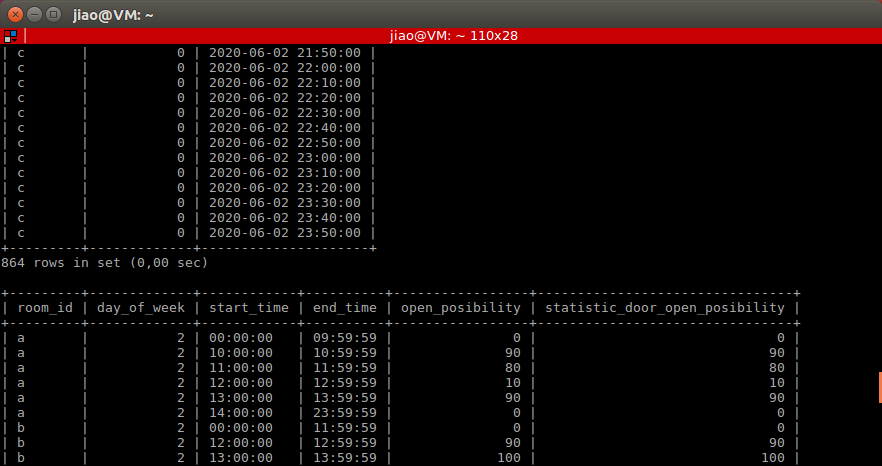

# robot_navigation
## How to use this program

### 1.  Create log file of door sensor:
1. install mysql library
'''
sudo apt-get install libmysqlcppconn-dev
'''

2. log in mysql server 

    `mysql -r root -p`

3. create door open possibility table and some data in  door status list
```
    source /home/[user_name]/catkin_ws/src/robot_navigation/sql/run.sql
```


### 2.  Start sensor node:
```
    roslaunch robot_navigation office_world.launch
    rosrun rosrun robot_navigation door_status_advertiser
```
## 3. Start navigation stack
```
    roslaunch robot_navigation robot_navigation.launch
```
use estimate position tool in rviz to estimate position

## 4. run demo
```
    roslaunch robot_navigation move_demo.launch
```
## Structure


## work flow


cost function = 100 - door open possibility +  0.2 * second different +  distance + 5* task priority + 100 - battery level

## Idea of simulation time
| Simulation time | door Simulator/ Centralized pool query in possibility table |
------|------------|
|   0:00:00 |   2020.06.01 06:00:00 | 
|   0:00:30 |   2020.06.01 12:00:00 |
|   0:00:59 |   2020.06.01 17:48:xx |
|   0:00:60 |   2020.06.02 06:00:00 |
|   ......     |

1s -12min

## TO DO

- simulation time issue
- when centralized pool receive request, it may let robot to go to battery charging station

## Problem

- battery consum