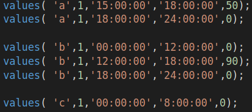
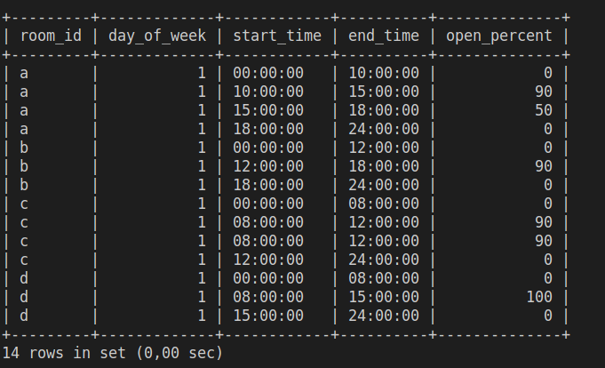
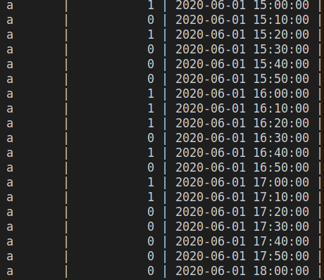
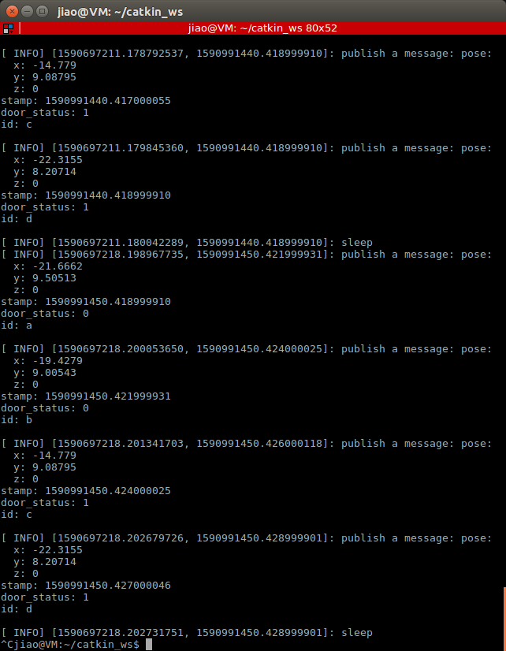
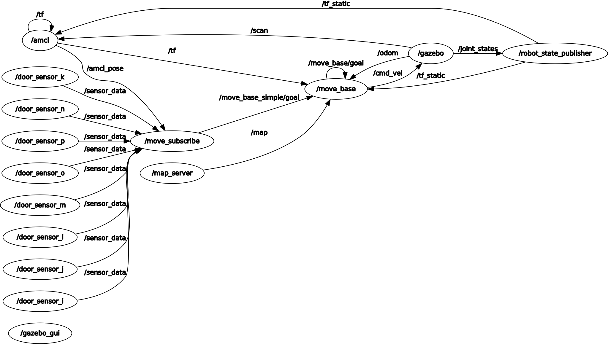
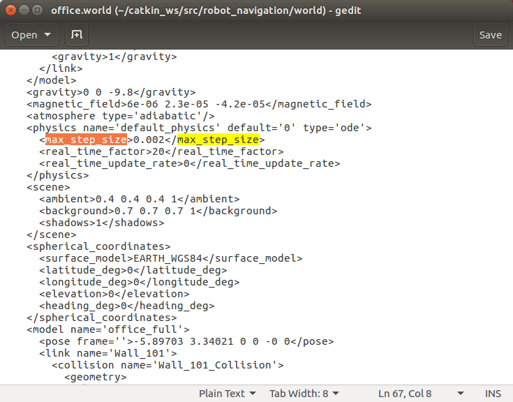
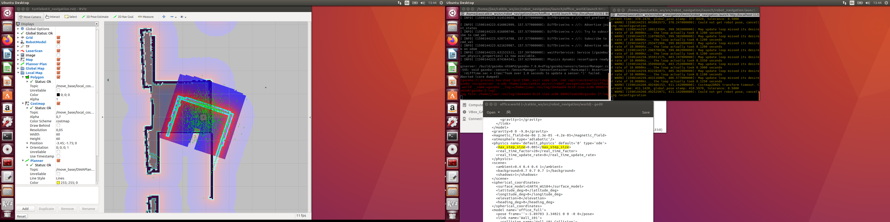

# robot_navigation
## How to use this program

### 1.  Create log file of door sensor:
1. log in mysql server 

    `mysql -r root -p`

2. create door open percent table 
```
    source /home/[user_name]/catkin_ws/src/robot_navigation/sql/createDoorOpenPercentTable.sql
```

createDoorOpenPercentTable.sql


program result

3. create a log file for door sensor in room a-d
```
    source /home/[user_name]/catkin_ws/src/robot_navigation/sql/createRawData.sql
    
```


### 2.  Start sensor node:
```
    roslaunch robot_navigation office_world.launch
    rosrun rosrun robot_navigation door_status_advertiser
```

## 3. Start navigation stack
```
    roslaunch robot_navigation robot_navigation.launch
```
use estimate position tool in rviz to estimate position

## 4. run demo
```
    roslaunch robot_navigation move_demo.launch
```
## work flow


## demo

https://www.youtube.com/watch?v=cLfMKVpCcfQ

## rqt graph




## TO DO

- use [clock](http://wiki.ros.org/Clock) package to simulate the time

- build global occupation possibility table

- write cost function = Θ1 * occupation possibility+  Θ2 * hour different +  Θ3* distance + Θ4* task priority + Θ5 * battery level + Θ6

## problem



