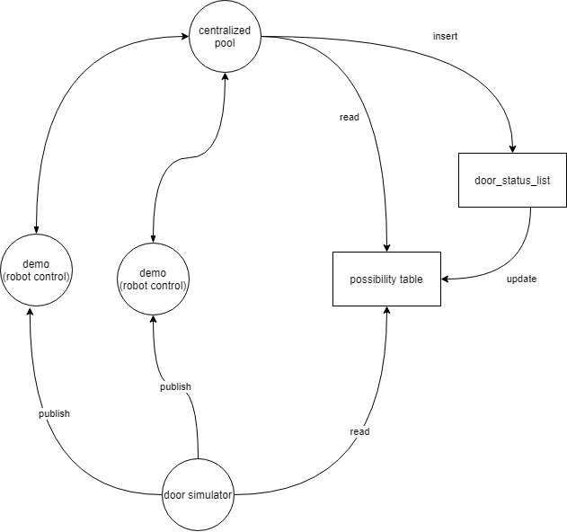
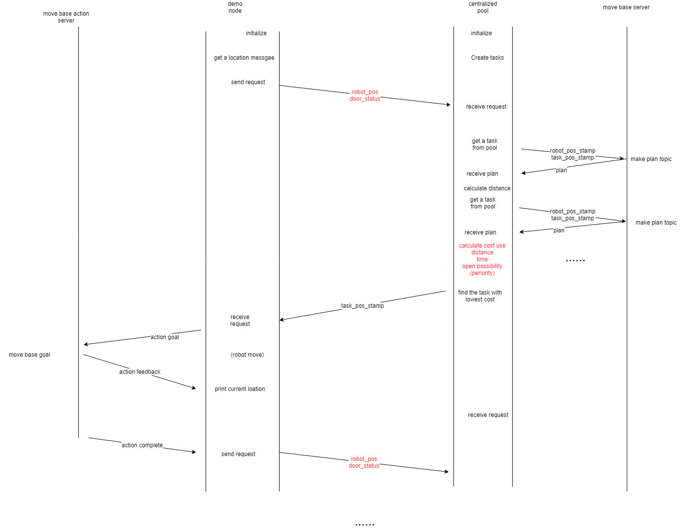

# robot_navigation
## How to use this program

### 1.  Create log file of door sensor:
1. install mysql library
'''
sudo apt-get install libmysqlcppconn-dev
'''

2. log in mysql server 

    `mysql -r root -p`

3. create door open possibility table 
```
    source /home/[user_name]/catkin_ws/src/robot_navigation/sql/run.sql
```

### 2.  Start sensor node:
```
    roslaunch robot_navigation office_world.launch
    rosrun rosrun robot_navigation door_status_advertiser
```
## 3. Start navigation stack
```
    roslaunch robot_navigation robot_navigation.launch
```
use estimate position tool in rviz to estimate position

## 4. run demo
```
    roslaunch robot_navigation move_demo.launch
```
## Structure



## work flow


cost function = 100 - door open possibility +  0.1 * second different +  distance + 5* task priority + 100 - battery level

## TO DO

- use [clock](http://wiki.ros.org/Clock) package to simulate the time
