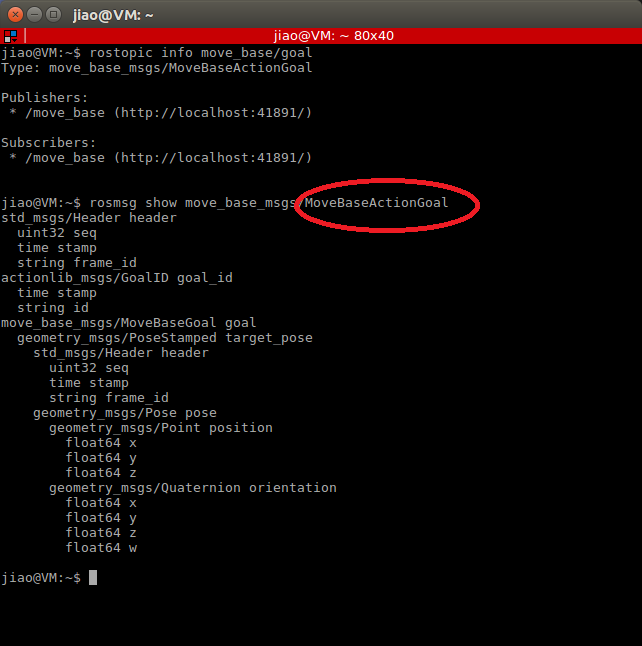
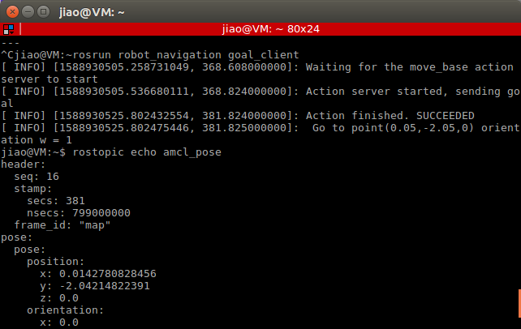

# robot_navigation


## Finished

1. Launch a 3d model on Gazebo

2. Create a map


3. Save the map

4. Execute navigation
```
roslaunch turtlebot3_navigation turtlebot3_navigation.launch map_file:=$HOME/map.yaml
```
5. Use keyboard to control robot

6. Found topic `move_base/goal` which user can use to set distination



7. Create an node which has an action client that can send a goal to action server.

8. Action client send a goal
```
frame id: map
stamp: now
target_pose
    pose:
        position x=0.05 y=-2.05 z=0
        orientation x=0 y=0 z=0 w=0
```

9. run this node, I can see the robot moves.



10. Beside this node I also create another node that publish to topic `/cmd_vel` which make robot move.

## TO DO

1. Create a map

3. Create a path subscriber node

4. Create a battery subscriber node

5. Write cost function

## Problems

create map failed


