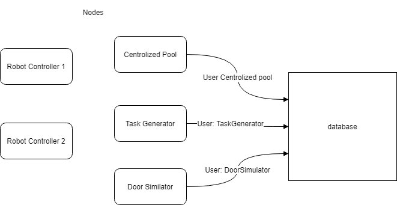
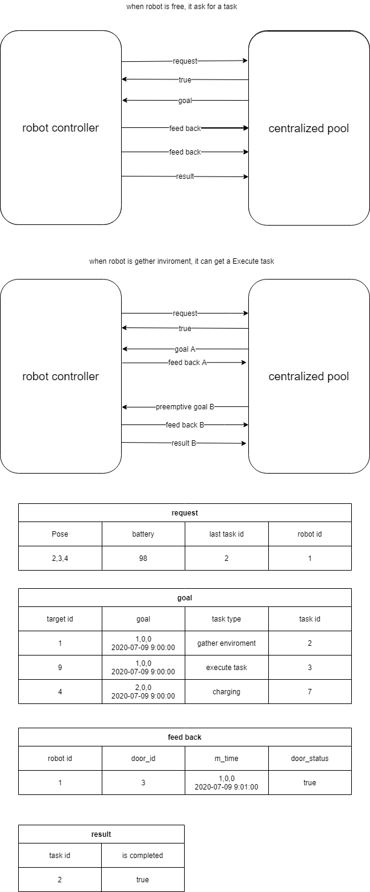
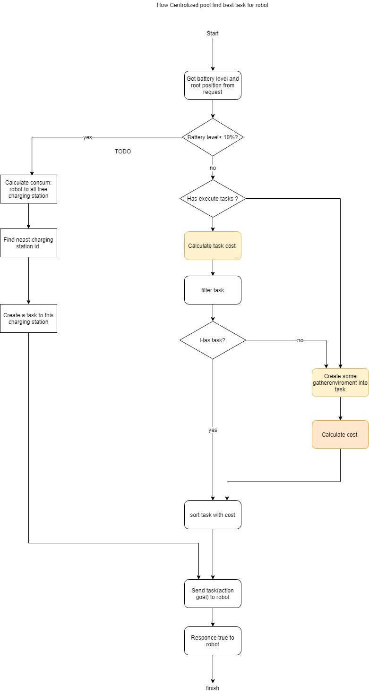
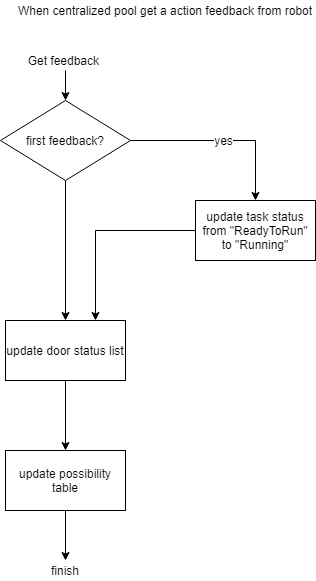
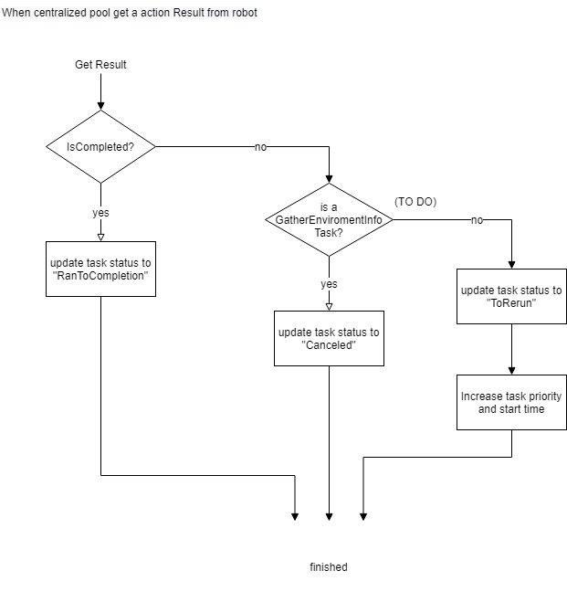
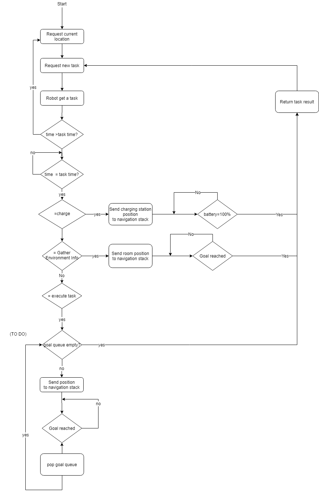
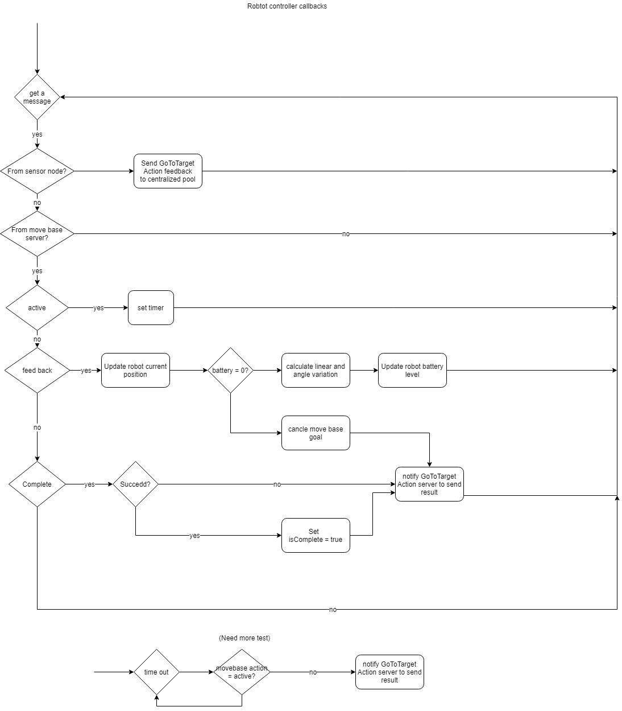

# robot_navigation
## How to use this program

### 1.  Create log file of door sensor:
1. install mysql library
'''
sudo apt-get install libmysqlcppconn-dev
'''

2. log in mysql server 

    `mysql -r root -p`

3. create tables
```
    source /home/[user_name]/catkin_ws/src/robot_navigation/sql/run.sql
```

Node Database




database 


targets


open_possibilities


tasks


cost


### 2. Set up

run Gazebo world

```
    roslaunch robot_navigation single_robot_simulation.launch
```
Use keyboard to controll one robot 

```
rosrun teleop_twist_keyboard teleop_twist_keyboard.py /cmd_vel:=/tb3_1/cmd_vel
```

Start sensor node

```
    rosrun rosrun robot_navigation door_status_advertiser
	
```
Start navigation stack

```
    roslaunch turtlebot3_navigation turtlebot3_navigation.launch

```
use estimate position tool in rviz to estimate position

## 3. run demo
```
    roslaunch robot_navigation move_demo.launch
```
## Structure



Centralized pool handle request task



Centralized pool handle feedback door status



Centralized pool handle task result



Robot controller



Robot controller callback



robot choose task with lowest cost

## Relative work

https://ieeexplore.ieee.org/abstract/document/7992870

When the time of the server reaches the request time, the server performs the task allocation. 

https://www.cs.utexas.edu/~pstone/Papers/bib2html-links/AAMAS17-Zhang.pdf

https://ieeexplore.ieee.org/abstract/document/8461113


## battery module

Calculate battery consume use angle of rotation and distance

```
distance = ......
double angle = 2 * acos(feedback->base_position.pose.orientation.w);
battery_level=  battery_level - 0.01 * distance - 0.001 * angle;

```

## Task type


## TO DO

- establish multi robot simulation
- read paper
